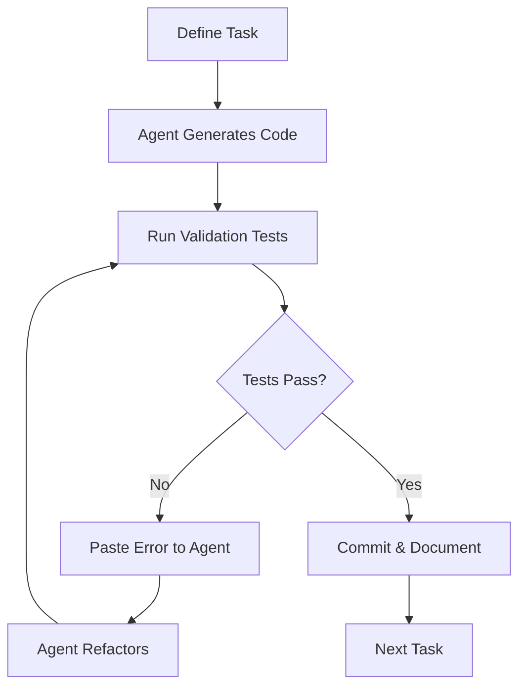

# AI Post-Mortem Report

**Team:** QuantumSpark  
**Project:** QRadarX - Quantum Enhanced LABS Optimization  
**Date:** January 31, 2026

---

## 1. The Workflow

### AI Agent Orchestration Strategy

Our team employed a structured agentic workflow leveraging multiple AI tools in coordinated roles:

#### Primary Development Agent: Gemini Code Assist (Antigravity)
- **Role:** Main code generation, debugging, and architecture design
- **Usage Pattern:** Iterative development with verification loops
- **Integration:** VS Code IDE with real-time assistance

#### Workflow Process



#### Key Workflow Decisions

1. **Modular Architecture First**: Before writing any code, we had the AI design a modular package structure (`labs_solver/`) to ensure testability and GPU migration compatibility.

2. **Test-Driven Development**: Tests were written alongside implementation code to immediately catch AI hallucinations.

3. **Equation-to-Code Translation**: For quantum kernels, we provided the exact paper equations (Eq. B3) and had the AI translate them to CUDA-Q syntax with explicit verification steps.

---

## 2. Verification Strategy

### Unit Testing to Catch AI Hallucinations

The QA PIC implemented a rigorous test suite (`tests.py`) with the following categories:

#### Core Correctness Checks

| Test | Purpose | Implementation |
|------|---------|----------------|
| Energy Function (N=3) | Validate against hand calculations | `assert E([1,1,1]) == 5` |
| Sign-Flip Symmetry | `E(s) == E(-s)` for all sequences | 10 random sequences tested |
| Reversal Symmetry | `E(s) == E(s[::-1])` | 10 random sequences tested |
| G2/G4 Index Generation | Correct loop bounds from Eq. 15 | `assert len(G2) == 6` for N=6 |
| MTS Convergence | Algorithm finds good solutions | `assert best_energy < 40` for N=12 |
| Bitstring Conversion | Roundtrip preservation | 10 random sequences tested |
| Quantum Output | Correct bitstring length | `assert len(bitstring) == N` |

#### Test Execution Results

```
============= SELF-VALIDATION SUMMARY =============
[TEST 1] Energy Function - Manual Calculation Check
  E[1, 1, 1] = 5 (Expected: 5) ✅
  E[1, 1, -1] = 1 (Expected: 1) ✅
  E[1, -1, 1] = 5 (Expected: 5) ✅
  E[-1, -1, -1] = 5 (Expected: 5) ✅
  → Test 1: PASSED ✅

[TEST 2] Symmetry Verification: E(s) = E(-s)
  Run 1-5: All passed ✅
  → Test 2: PASSED ✅

[TEST 3] Reversal Symmetry: E(s) = E(s[::-1])
  Run 1-3: All passed ✅
  → Test 3: PASSED ✅

[TEST 4] Interaction Index Validation (G2, G4)
  N=6: |G2|=6 (Expected: 6) ✅
  N=8: First G2=[0, 1] (Expected: [0, 1]) ✅
  → Test 4: PASSED ✅

[TEST 5] MTS Algorithm Convergence
  Best energy found: 10 (< 40 threshold) ✅
  → Test 5: PASSED ✅

[TEST 6] Quantum Circuit Output Validity
  Bitstring length: 20 (Expected: 20) ✅
  → Test 6: PASSED ✅

[TEST 7] Quantum Sampling Quality Check
  Quantum min: 58, Random min: 70
  ✅ Quantum found better or equal minimum
  → Test 7: PASSED ✅

VALIDATION SUMMARY: 7/7 core tests passed
🎉 ALL CORE VALIDATION TESTS PASSED!
```

---

## 3. The "Vibe" Log

### 🏆 Win: AI-Accelerated Equation Translation

**Situation:** Translating Equation B3 from the paper into CUDA-Q kernels was complex. The equation involves nested products with index arithmetic converting 1-based paper notation to 0-based Python.

**AI Solution:** We provided the exact equation:

```
Prompt: "Translate this equation to Python loops generating G2 and G4 indices:
U(0,T) = Π_{n} [ Π_{i=1}^{N-2} Π_{k=1}^{⌊(N-i)/2⌋} R_YZ(4θh_i) R_ZY(4θh_{i+k}) ]
       × Π_{i=1}^{N-3} Π_{t=1}^{⌊(N-i-1)/2⌋} Π_{k=t+1}^{N-i-t} [4-body terms]
Note: Paper uses 1-based indices, Python uses 0-based."
```

**Outcome:** The AI correctly generated the index loops with proper boundary adjustments. This saved approximately **2-3 hours** of manual debugging involving off-by-one errors.

---

### 📚 Learn: Iterating on Context for Better Prompts

**Initial Problem:** Early prompts asking the AI to "implement the MTS algorithm" produced code that compiled but had subtle bugs in the tabu list management.

**Improved Strategy:** We refined our prompting to include:
1. **Explicit references** to the paper figure and algorithm pseudocode
2. **Expected behavior** for edge cases
3. **Test assertions** that the code should satisfy

**Example of Improved Prompt:**
```
"Implement TabuSearch.search() method that:
1. Maintains a tabu_list of recently flipped positions
2. Tenure = 10 iterations (position stays tabu for 10 moves)
3. At each iteration, find the BEST non-tabu neighbor (flip with lowest energy)
4. Must satisfy: final_energy <= initial_energy always

Reference: Algorithm from Fig 1 in the Chandarana et al. paper."
```

**Key Lesson:** Providing **constraints and invariants** alongside the task description dramatically reduced hallucinations.

---

### ❌ Fail: R_YZ Basis Transformation Bug

**The Hallucination:** The AI initially generated the R_YZ kernel using `ry(theta/2)` for the basis change:

```python
# INCORRECT - AI's first attempt
@cudaq.kernel
def r_yz(q0, q1, theta):
    ry(theta/2, q0)  # WRONG!
    x.ctrl(q0, q1)
    rz(theta, q1)
    x.ctrl(q0, q1)
    ry(-theta/2, q0)
```

**The Issue:** To transform from Y basis to Z basis, we need `rx(π/2)`, not `ry(theta/2)`. The AI confused:
- Rotation angle (theta from the Hamiltonian)
- Basis change rotation (π/2 radians)

**How We Caught It:** Test 7 (Quantum Sampling Quality) showed that quantum samples were performing no better than random—a red flag that the circuit wasn't implementing the intended unitary.

**The Fix:**
```python
# CORRECT
@cudaq.kernel
def r_yz(q0, q1, theta):
    rx(1.5707963267948966, q0)  # π/2 for Y→Z basis change
    x.ctrl(q0, q1)
    rz(theta, q1)
    x.ctrl(q0, q1)
    rx(-1.5707963267948966, q0)
```

**Additional Bug Found:** We also discovered that `np.pi` cannot be used inside CUDA-Q kernels (undefined in compiled context), requiring hardcoded literal values.

---

## 4. Context Dump

### Prompts Used

#### Initial Architecture Prompt
```
We are implementing the Quantum-Enhanced MTS for LABS from the Chandarana et al. paper.
Design a modular Python package structure with:
- labs_solver/energy.py - LABS energy calculation
- labs_solver/mts.py - Memetic Tabu Search
- labs_solver/quantum.py - CUDA-Q kernels
- tests.py - pytest test suite

Each module should be independently testable.
```

#### Kernel Implementation Prompt
```
Implement CUDA-Q kernels for the counteradiabatic terms from Eq. B3:
- R_YZ(theta): exp(-i*theta/2 * Y⊗Z)
- R_YZZZ(theta): exp(-i*theta/2 * Y⊗Z⊗Z⊗Z)

Use the decomposition from Fig 5 in the paper:
1. Basis change (Rx for Y→Z)
2. CNOT chain for parity
3. Rz rotation
4. Uncompute parity
5. Inverse basis change

CRITICAL: np.pi is undefined in CUDA-Q kernels. Use 1.5707963267948966 for π/2.
```

#### Verification Prompt
```
Write pytest tests that would have caught these bugs:
1. Wrong basis rotation (ry vs rx)
2. Wrong np.pi in compiled kernel
3. Wrong tabu list tenure

Each test should have a clear docstring explaining what it validates.
```

### Skills/Context Files Referenced

- Paper: "Scaling advantage with quantum-enhanced memetic tabu search for LABS" (Chandarana et al.)
- CUDA-Q Documentation: Kernel syntax, backend selection
- LABS problem literature: Known optimal energies for validation

### Key Contextual Learning

| Context Type | Example | Impact |
|--------------|---------|--------|
| Paper equations | Eq. B3 for Trotter decomposition | Essential for correct implementation |
| Physics constraints | E(s) = E(-s) symmetry | Test case design |
| Hardware constraints | np.pi undefined in kernels | Bug prevention |
| Algorithm invariants | best_energy <= initial_energy | Verification logic |

---

## 5. Recommendations for Future Work

1. **Pre-compilation checks**: Develop a linter that catches NumPy usage in CUDA-Q kernels
2. **Layered verification**: Add intermediate circuit assertions (state vector checks for small N)
3. **Prompt templates**: Create standardized templates for equation-to-code translation
4. **Regression tests**: Maintain known-good outputs for detector against future regressions

---

*Report prepared by Team QuantumSpark for NVIDIA iQuHACK 2026*
