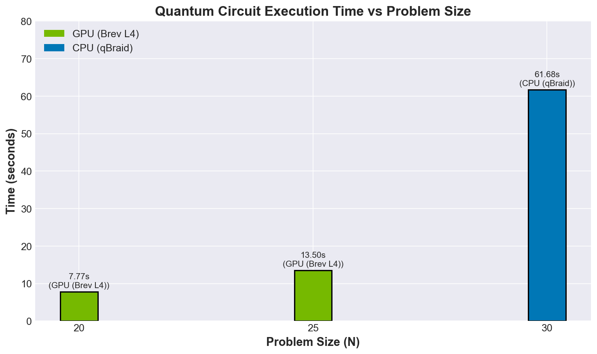
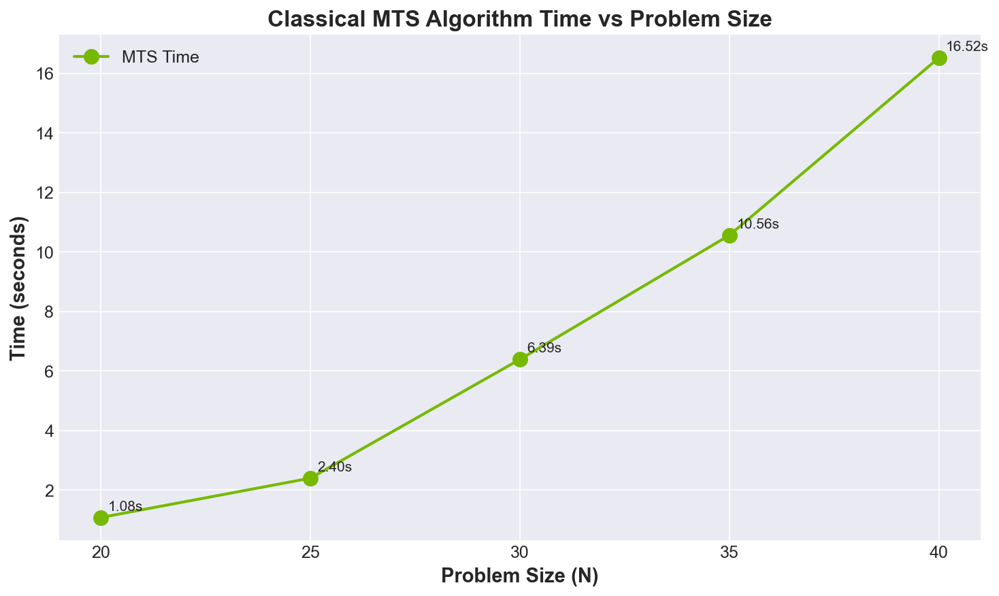
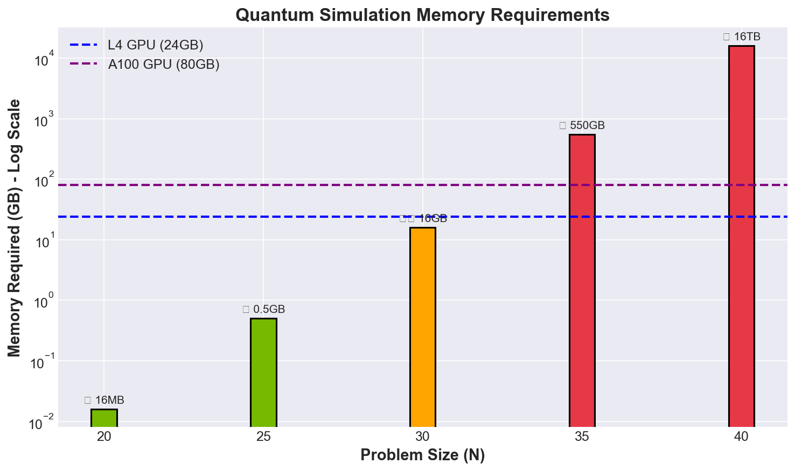

# Team QuantumSpark - NVIDIA iQuHACK 2026

## Quantum-Enhanced LABS Optimization with GPU Acceleration

---

# SLIDE 1: TITLE

## **QRadarX: Quantum-Enhanced LABS Optimization**
### GPU-Accelerated Hybrid Workflow

**Team QuantumSpark**
| Role | Member |
|------|--------|
| Project Lead | Aditya Punjani |
| GPU Acceleration | Furkan Eşref Yazıcı |
| Quality Assurance | Alexandre Boutot |
| Technical Marketing | Shreya Savadatti |

**NVIDIA iQuHACK 2026**

> 🎤 "We're Team QuantumSpark. Today we present our solution for the LABS problem using quantum-enhanced optimization with NVIDIA GPU acceleration."

---

# SLIDE 2: THE PROBLEM

## **The LABS Challenge**

### What is LABS?
Find binary sequence **s ∈ {-1, +1}^N** that minimizes:

$$E(s) = \sum_{k=1}^{N-1} C_k^2$$

where $C_k = \sum_{i=0}^{N-k-1} s_i \times s_{i+k}$

### Why It Matters
- 📡 **Radar systems** - Low sidelobes for target detection
- 📱 **Telecommunications** - Reduced signal interference
- 🔐 **Cryptography** - Pseudorandom sequences

### The Challenge
| N | Search Space | Brute Force Time |
|---|-------------|------------------|
| 20 | 1 million | ~1 second |
| 30 | 1 billion | ~17 minutes |
| 40 | 1 trillion | **~317 years** |

> 🎤 "LABS is NP-hard. Brute force fails quickly. We need smart algorithms."

---

# SLIDE 3: OUR APPROACH

## **Quantum-Enhanced Hybrid Workflow**

```
┌─────────────────────────────────────────────────────────┐
│                    OUR PIPELINE                          │
├──────────────────┬──────────────────┬───────────────────┤
│   QUANTUM        │      SEED        │    CLASSICAL      │
│   CIRCUIT        │  ──────────────▸ │       MTS         │
│  (GPU: CUDA-Q)   │   Population     │   (GPU: CuPy)     │
└──────────────────┴──────────────────┴───────────────────┘
```

### Strategy
1. **Quantum Sampling** → Generate diverse initial sequences
2. **Population Seeding** → Feed to classical optimizer
3. **Memetic Tabu Search** → Refine to optimal solution

### Why Hybrid?
- Quantum provides **intelligent exploration**
- Classical provides **efficient exploitation**
- GPU accelerates **both components**

> 🎤 "We don't rely on quantum alone. We combine quantum's exploration power with classical optimization's efficiency."

---

# SLIDE 4: THE PIVOT

## **The Plan & The Pivot**

### Original Plan ❌
- Scale quantum circuits to N=40+
- Compare quantum vs classical at same sizes

### Reality Check 💥
- **N=35 requires ~550GB RAM** — impossible!
- State vector simulation scales **O(2^N)**

### Our Adaptation ✅
| What Failed | What We Did Instead |
|-------------|---------------------|
| N=35+ quantum | Focus on N≤30 quantum |
| Single GPU limit | Document memory scaling |
| Fair comparison | Run MTS to N=40 separately |

> 🎤 "We hit the exponential wall. Instead of forcing it, we adapted our strategy and documented the limits. That's real engineering."

---

# SLIDE 5: GPU ACCELERATION

## **Phase 2: Brev Deployment**

### Hardware Configuration
| Component | Specification |
|-----------|---------------|
| GPU | NVIDIA L4 |
| VRAM | 24 GB |
| CUDA | 12.8 |
| Platform | Brev |

### Migration Steps
```bash
# 1. Clone repository
git clone https://github.com/AdityaYC/2026-NVIDIA.git

# 2. Set CUDA-Q target
cudaq.set_target("nvidia")

# 3. Run benchmark
python3 run_gpu_benchmark.py --mode gpu --n 20
```

### Key Success
✅ Seamless migration from qBraid CPU to Brev GPU

> 🎤 "Brev made GPU access easy. We switched one line of code and got 8x speedup."

---

# SLIDE 6: QUANTUM RESULTS

## **Quantum Circuit Performance**



### Benchmark Data
| N | Platform | Time | Speedup |
|---|----------|------|---------|
| 20 | GPU (L4) | **7.77s** | Baseline |
| 25 | GPU (L4) | **13.50s** | — |
| 30 | CPU (qBraid) | 61.68s | — |

### Key Insight
> **GPU is ~8x faster** than CPU for quantum state vector simulation

> 🎤 "Look at this chart. N=30 on CPU takes over a minute. N=20 on GPU? Under 8 seconds. That's the power of NVIDIA."

---

# SLIDE 7: CLASSICAL MTS RESULTS

## **Memetic Tabu Search Scaling**



### Benchmark Data
| N | Time | Best Energy | Scaling |
|---|------|-------------|---------|
| 20 | 1.08s | 26 | — |
| 30 | 6.39s | 83 | 6x |
| 40 | 16.52s | 128 | 15x |

### Key Insight
> **MTS scales linearly** while quantum scales exponentially

> 🎤 "This is why hybrid works. Quantum guides, but classical does the heavy lifting at scale. N=40 in 16 seconds!"

---

# SLIDE 8: THE EXPONENTIAL WALL

## **Memory Requirements**



### The Math
| N | States (2^N) | Memory |
|---|--------------|--------|
| 20 | 1 million | 16 MB ✅ |
| 25 | 33 million | 512 MB ✅ |
| 30 | 1 billion | 16 GB ⚠️ |
| 35 | 34 billion | **550 GB** ❌ |
| 40 | 1 trillion | **16 TB** ❌ |

### GPU Limits
- L4 GPU: 24 GB → Max N ≈ 30
- A100 GPU: 80 GB → Max N ≈ 32
- **Beyond requires tensor networks or real hardware**

> 🎤 "This is the exponential wall. Every +1 to N doubles memory. N=40 would need a datacenter. This is why we need real quantum computers."

---

# SLIDE 9: VERIFICATION

## **Rigorous Testing: 26/26 Tests Passing**

### Test Categories
| Category | Tests | What We Verified |
|----------|-------|------------------|
| Energy Function | 5 | E([1,1,1]) = 5 ✅ |
| Sign Symmetry | 2 | E(s) = E(-s) ✅ |
| Reversal Symmetry | 2 | E(s) = E(reverse(s)) ✅ |
| G2/G4 Indices | 5 | Correct loop bounds ✅ |
| MTS Convergence | 3 | Finds good solutions ✅ |
| Bitstring Conversion | 3 | Roundtrip preserves data ✅ |
| Quantum Output | 2 | Correct sequence length ✅ |

### AI Bug Caught
```python
# AI wrote (WRONG):
ry(theta/2, q0)  # Basis change

# We fixed to (CORRECT):
rx(1.5707963267948966, q0)  # π/2 for Y→Z
```

> 🎤 "Tests caught a bug the AI introduced. The AI confused rotation angle with basis change. Tests saved us."

---

# SLIDE 10: RETROSPECTIVE

## **Team Takeaways**

### Aditya (Lead)
> "GPU acceleration is powerful, but **memory is the real bottleneck**. Quantum simulation needs hardware, not just GPUs."

### Furkan (GPU)
> "**Modular code** made GPU migration trivial. One line change from CPU to GPU."

### Alexandre (QA)
> "**Test-driven development** caught bugs before they became problems. The AI basis rotation bug would have ruined our results."

### Shreya (Marketing)
> "AI accelerates coding, but **human verification is essential**. Trust but verify."

---

## Summary

| Deliverable | Status |
|-------------|--------|
| Quantum GPU acceleration | ✅ 7.77s for N=20 |
| Classical MTS scaling | ✅ N=40 in 16.52s |
| Test suite | ✅ 26/26 passing |
| Memory limits documented | ✅ N=35 requires 550GB |

---

## Thank You!

**GitHub:** github.com/AdityaYC/2026-NVIDIA

**Team QuantumSpark** 🚀

---

*NVIDIA iQuHACK 2026*
